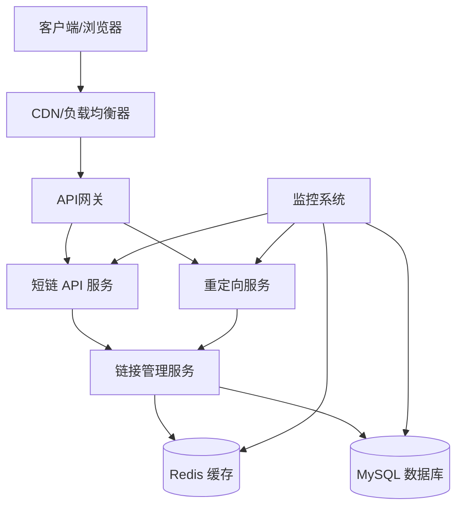
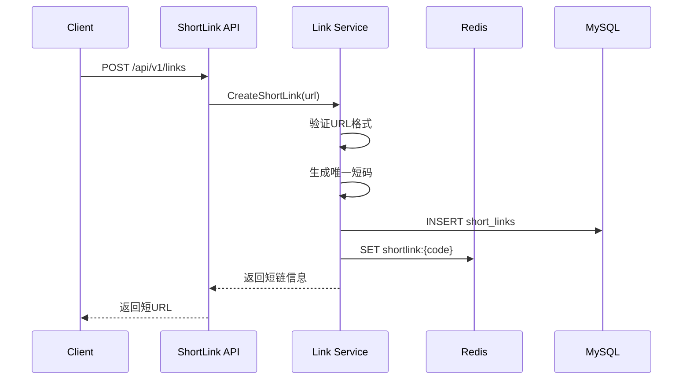
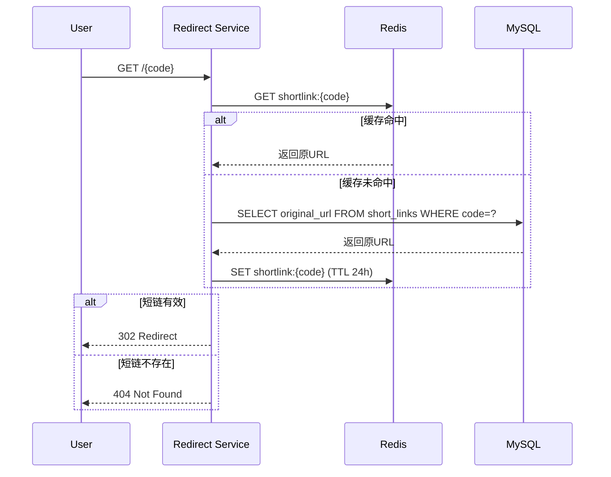
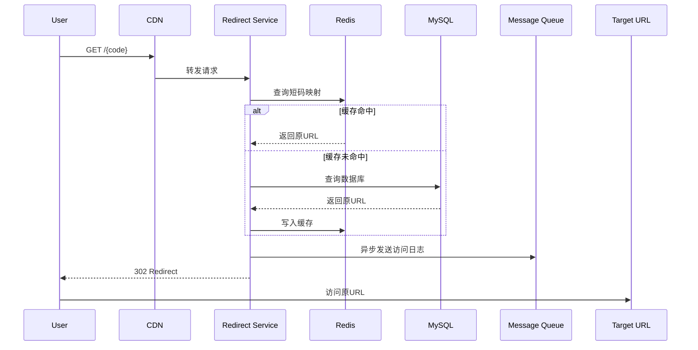
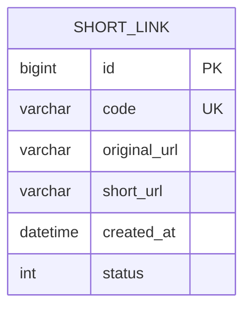

# 短链服务（ShortLink）需求文档

**文档版本**: v1.0  
**创建日期**: 2026-04-18  
**最后更新**: 2026-04-18  
**状态**: 草稿

---

## 目录

1. [项目概述](#1-项目概述)
2. [功能需求](#2-功能需求)
3. [非功能需求](#3-非功能需求)
4. [系统架构设计](#4-系统架构设计)
5. [数据模型设计](#5-数据模型设计)
6. [API设计](#6-api设计)
7. [技术栈选择](#7-技术栈选择)

---

## 1. 项目概述

### 1.1 业务目标

短链服务（ShortLink）是一个高可用、高性能的URL缩短服务，旨在将冗长的URL转换为简洁的短URL，便于分享、传播和统计分析。

**核心价值**：
- 提升用户体验：短链接更易于记忆和分享
- 数据分析：追踪链接点击量、来源、地理位置等数据
- 品牌定制：支持自定义短链前缀
- 高可用性：保证99.99%的服务可用性

### 1.2 应用场景

- 社交媒体分享（微博、微信等字符限制场景）
- 短信营销（节省短信字符数）
- 二维码生成（简化二维码复杂度）
- 广告投放追踪
- 企业内部链接管理

### 1.3 项目范围

**本期实现（MVP）**：
- URL缩短核心功能
- 短链重定向

**未来规划**：
- 自定义短链后缀
- 链接过期管理
- 访问统计功能
- 防刷限流策略
- 用户系统集成

---

## 2. 功能需求

### 2.1 核心功能

#### 2.1.1 URL缩短（Create Short Link）

**功能描述**：将用户提交的长URL转换为短URL

**输入**：
- 原始URL（必填）
- 自定义短码（可选，MVP阶段可选支持）

**处理逻辑**：
1. 验证URL格式合法性
2. 生成唯一短码（62进制编码）
3. 存储短码与原URL的映射关系
4. 返回短URL

**输出**：
- 短URL
- 短码
- 创建时间

**约束**：
- URL长度限制：最长2048字符
- 短码长度：固定6位（可配置）
- 短码唯一性保证

#### 2.1.2 短链重定向（Redirect）

**功能描述**：用户访问短URL时，302重定向到原始URL

**处理逻辑**：
1. 解析短码
2. 查询缓存获取原URL
3. 缓存未命中时查询数据库
4. 返回HTTP 302重定向

**约束**：
- 响应时间 < 50ms（P99）
- 使用302临时重定向
- 短链不存在时返回404

---

## 3. 非功能需求

### 3.1 性能要求

| 指标 | 目标值 | 说明 |
|------|--------|------|
| 重定向响应时间 | P99 < 50ms | 短链访问重定向 |
| 创建短链响应时间 | P99 < 100ms | 生成短链接口 |
| QPS（重定向） | ≥ 10,000 | 峰值处理能力 |
| QPS（创建） | ≥ 1,000 | 峰值处理能力 |
| 并发连接数 | ≥ 50,000 | 最大并发连接 |

### 3.2 可用性要求

- **服务可用性**: 99.99%（年停机时间 < 52分钟）
- **数据持久性**: 99.999999999%（11个9）
- **故障恢复时间**: RTO < 5分钟
- **数据恢复点**: RPO < 1分钟

### 3.3 可扩展性

- **水平扩展**: 支持无状态服务节点动态扩容
- **垂直扩展**: 支持单机性能调优
- **存储扩展**: 支持分库分表、分布式存储

### 3.4 安全性

#### 3.4.1 访问控制

- API接口认证（JWT/API Key）
- 管理接口权限控制
- IP白名单/黑名单

#### 3.4.2 数据安全

- 敏感数据加密存储
- 传输层加密（HTTPS）
- SQL注入防护
- XSS攻击防护

#### 3.4.3 防滥用策略

- 限流（Token Bucket / Sliding Window）
- 防刷机制（同一IP频率限制）
- 恶意URL检测
- 短码爆破防护

### 3.5 可维护性

- **日志记录**: 结构化日志，支持链路追踪
- **监控告警**: Prometheus + Grafana
- **健康检查**: HTTP健康检查端点
- **文档**: API文档自动生成（Swagger）

### 3.6 兼容性

- 支持HTTP/1.1和HTTP/2
- 支持IPv4和IPv6
- 向下兼容API版本

---

## 4. 系统架构设计

### 4.1 整体架构



### 4.2 模块划分

#### 4.2.1 API网关层

**职责**：
- 请求路由
- 负载均衡
- 限流熔断
- SSL终止

#### 4.2.2 短链 API 服务

**职责**：
- 短链创建
- 参数校验
- 业务逻辑处理

**接口**：
- POST /api/v1/links - 创建短链

#### 4.2.3 重定向服务

**职责**：
- 高并发短链重定向
- 缓存读写
- 异步记录访问日志

**特点**：
- 无状态设计
- 极致优化响应时间
- 支持独立扩容

#### 4.2.4 链接管理服务

**职责**：
- 短码生成算法
- URL 验证
- 缓存策略管理
- 数据持久化

### 4.3 核心流程

#### 4.3.1 创建短链流程



#### 4.3.2 重定向流程





### 4.4 短码生成策略

#### 4.4.1 方案对比

| 方案 | 优点 | 缺点 | 适用场景 |
|------|------|------|----------|
| 自增ID转62进制 | 简单、唯一 | 易被遍历、需分布式ID生成器 | 中小规模 |
| Hash(MD5/SHA1) | 唯一性好 | 碰撞处理复杂、长度固定 | 大规模 |
| Snowflake算法 | 分布式友好、有序 | 需要时钟同步 | 分布式系统 |
| 随机字符串 | 不可预测 | 碰撞概率需计算 | 安全要求高 |

#### 4.4.2 推荐方案

**采用方案**: Snowflake算法 + 62进制编码

**理由**：
- 支持分布式部署
- 短码有序（便于排查问题）
- 碰撞概率极低
- 性能优秀

**实现**：
```
短码长度: 6位
字符集: [0-9a-zA-Z] (62个字符)
容量: 62^6 ≈ 568亿
```

---

## 5. 数据模型设计

### 5.1 实体关系图



### 5.2 表结构设计

#### 5.2.1 短链表（short_links）

```sql
CREATE TABLE `short_links` (
  `id` BIGINT UNSIGNED NOT NULL AUTO_INCREMENT COMMENT '主键ID',
  `code` VARCHAR(10) NOT NULL COMMENT '短码',
  `original_url` VARCHAR(2048) NOT NULL COMMENT '原始URL',
  `short_url` VARCHAR(255) NOT NULL COMMENT '短URL',
  `status` TINYINT NOT NULL DEFAULT 1 COMMENT '状态: 1-正常 0-禁用',
  `created_at` DATETIME NOT NULL DEFAULT CURRENT_TIMESTAMP COMMENT '创建时间',
  `updated_at` DATETIME NOT NULL DEFAULT CURRENT_TIMESTAMP ON UPDATE CURRENT_TIMESTAMP COMMENT '更新时间',
  PRIMARY KEY (`id`),
  UNIQUE KEY `uk_code` (`code`),
  KEY `idx_created_at` (`created_at`)
) ENGINE=InnoDB DEFAULT CHARSET=utf8mb4 COMMENT='短链信息表';
```

**索引策略**：
- `uk_code`: 唯一索引，高频查询（重定向）
- `idx_created_at`: 时间范围查询

### 5.3 Redis缓存设计

#### 5.3.1 缓存结构

```
# 短码 -> URL映射（核心缓存）
Key: shortlink:{code}
Value: {original_url}
TTL: 24小时
```

#### 5.3.2 缓存策略

- **缓存命中率目标**: > 95%
- **缓存穿透**: 空值缓存（短码不存在时缓存空值，TTL 5分钟）
- **缓存雪崩**: 随机过期时间（±10%）
- **缓存更新**: Write-through（写入数据库同时写入缓存）

---

## 6. API设计

### 6.1 API规范

- **协议**: HTTPS
- **数据格式**: JSON
- **字符编码**: UTF-8
- **时间格式**: ISO 8601 (YYYY-MM-DDTHH:mm:ssZ)
- **认证方式**: Bearer Token (JWT)

### 6.2 通用响应格式

```json
{
  "code": 200,
  "message": "success",
  "data": {},
  "timestamp": "2026-04-18T10:30:00Z"
}
```

### 6.3 错误码定义

| 错误码 | HTTP状态码 | 说明 |
|--------|-----------|------|
| 200 | 200 | 成功 |
| 400 | 400 | 请求参数错误 |
| 401 | 401 | 未授权 |
| 403 | 403 | 禁止访问 |
| 404 | 404 | 资源不存在 |
| 409 | 409 | 资源冲突 |
| 429 | 429 | 请求过于频繁 |
| 500 | 500 | 服务器内部错误 |

### 6.4 接口详情

#### 6.4.1 创建短链

```
POST /api/v1/links
```

**请求头**:
```
Content-Type: application/json
```

**请求体**:
```json
{
  "url": "https://example.com/very/long/url/with/many/parameters?foo=bar&baz=qux"
}
```

**响应** (201 Created):
```json
{
  "code": 201,
  "message": "success",
  "data": {
    "code": "a3Kj9x",
    "original_url": "https://example.com/very/long/url/with/many/parameters?foo=bar&baz=qux",
    "short_url": "https://s.link/a3Kj9x",
    "created_at": "2026-04-18T10:30:00Z"
  }
}
```

**错误响应** (400 Bad Request):
```json
{
  "code": 400,
  "message": "Invalid URL format",
  "data": null
}
```

---

#### 6.4.2 短链重定向

```
GET /{code}
```

**响应** (302 Found):
```
HTTP/1.1 302 Found
Location: https://example.com/very/long/url
Cache-Control: no-cache
```

**响应** (404 Not Found):
```json
{
  "code": 404,
  "message": "Short link not found",
  "data": null
}
```

---

## 7. 技术栈选择

### 7.1 技术栈总览

| 层级 | 技术 | 版本 | 选型理由 |
|------|------|------|----------|
| **开发语言** | Go | 1.21+ | 高性能、并发友好、编译速度快 |
| **Web 框架** | Gin | 最新版 | 轻量、高性能、生态丰富 |
| **数据库** | MySQL | 8.0+ | 成熟稳定、支持事务、生态完善 |
| **缓存** | Redis | 7.0+ | 高性能、数据结构丰富、支持集群 |
| **ORM** | GORM | 最新版 | Go 生态最流行、功能完善 |
| **配置管理** | Viper | 最新版 | 支持多格式、环境变量、远程配置 |
| **日志** | Zap | 最新版 | 高性能结构化日志 |
| **监控** | Prometheus + Grafana | 最新版 | 行业标准、可视化强大 |
| **API 文档** | Swagger / Gin-Swagger | 最新版 | 自动生成、易于维护 |
| **容器化** | Docker | 最新版 | 标准化部署、环境一致 |

---

## 附录

### A. 性能优化建议

1. **数据库优化**:
   - 合理设计索引
   - 避免N+1查询
   - 使用连接池
   - 分库分表（数据量大时）

2. **缓存优化**:
   - 热点数据预加载
   - 本地缓存 + Redis二级缓存
   - 缓存穿透/击穿/雪崩防护

3. **代码优化**:
   - 对象池复用
   - 避免内存泄漏
   - 合理使用Goroutine
   - 减少锁竞争

### B. 安全加固建议

1. 定期更新依赖包
2. 使用HTTPS强制加密
3. 实施CORS策略
4. 启用HTTP安全头（HSTS、X-Frame-Options等）
5. 定期安全扫描
6. 实施最小权限原则

### C. 扩展性规划

1. **读写分离**: MySQL主从架构
2. **微服务拆分**: 按业务域拆分服务
3. **多机房部署**: 异地多活
4. **边缘计算**: CDN边缘节点处理重定向

### D. 参考文档

- [RFC 3986 - Uniform Resource Identifier (URI)](https://tools.ietf.org/html/rfc3986)
- [HTTP 301/302 Redirect](https://developer.mozilla.org/en-US/docs/Web/HTTP/Redirections)
- [MySQL 8.0 Reference Manual](https://dev.mysql.com/doc/)
- [Redis Documentation](https://redis.io/documentation)
- [Kubernetes Documentation](https://kubernetes.io/docs/)

---

**文档结束**

本文档由AI技术架构师生成，基于SDD（Spec-Driven Development）方法论，为ShortLink项目提供完整的需求规格说明。在实施过程中，请根据实际情况调整和优化。
