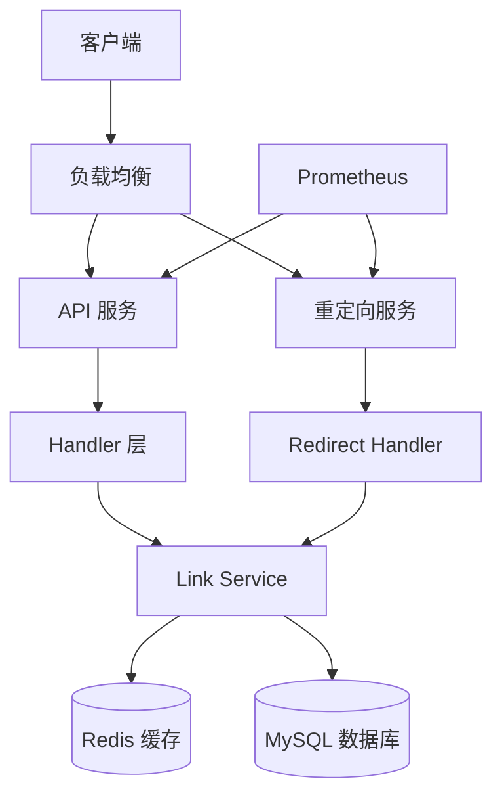
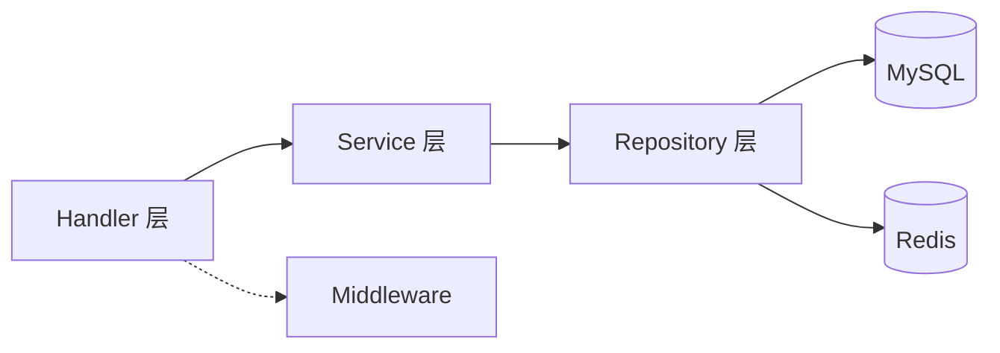
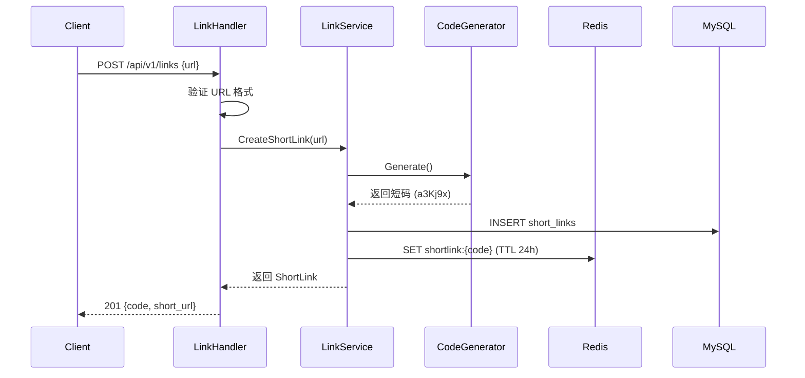
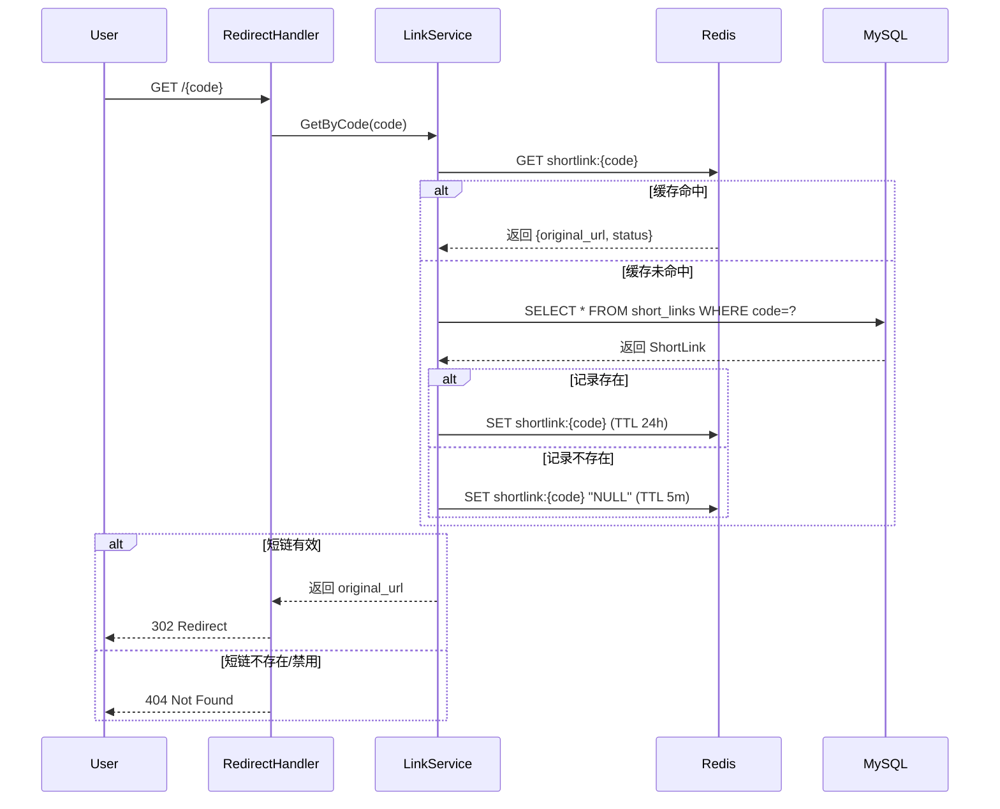
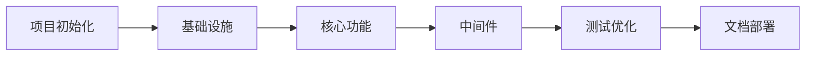

# ShortLink 短链服务 - 技术设计方案

**文档版本**: v1.0  
**创建日期**: 2026-04-18  
**技术架构师**: AI Tech Designer  
**基于文档**: REQUIREMENTS.md v1.0  
**状态**: 待评审

---

## 目录

1. [需求概述](#1-需求概述)
2. [现状分析](#2-现状分析)
3. [架构设计](#3-架构设计)
4. [详细设计](#4-详细设计)
5. [技术选型](#5-技术选型)
6. [实施计划](#6-实施计划)
7. [风险与应对](#7-风险与应对)
8. [测试策略](#8-测试策略)

---

## 1. 需求概述

### 1.1 业务目标

构建一个高可用、高性能的 URL 缩短服务（MVP 阶段），核心价值：
- **URL 缩短**：将长 URL 转换为简洁的短 URL（6 位短码）
- **短链重定向**：用户访问短链时 302 重定向到原 URL（P99 < 50ms）
- **高可用性**：保证 99.99% 的服务可用性

### 1.2 核心功能清单（MVP）

| 功能 | 优先级 | 说明 |
|------|--------|------|
| URL 缩短 | P0 | POST /api/v1/links，生成 6 位短码 |
| 短链重定向 | P0 | GET /{code}，302 重定向到原 URL |

### 1.3 非功能需求

**性能指标**：
- 重定向响应时间：P99 < 50ms
- 创建短链响应时间：P99 < 100ms
- 重定向 QPS：≥ 10,000
- 创建 QPS：≥ 1,000
- 并发连接数：≥ 50,000

**可用性指标**：
- 服务可用性：99.99%
- 数据持久性：99.999999999%
- RTO < 5 分钟，RPO < 1 分钟

**安全要求**：
- HTTPS 加密传输
- SQL 注入防护
- XSS 攻击防护
- 限流防刷（Token Bucket）

---

## 2. 现状分析

### 2.1 当前状态

- **项目阶段**：初始阶段，无代码实现
- **技术栈**：计划使用 Go + Gin + MySQL + Redis
- **项目结构**：空项目，需从零搭建

### 2.2 技术约束

- 遵循 SDD（Spec-Driven Development）方法论
- Go 1.21+ 版本
- 分层架构（Handler → Service → Repository）
- RESTful API 设计

### 2.3 可复用组件

Go 生态成熟组件：
- `gin-gonic/gin`：HTTP 框架
- `gorm.io/gorm`：ORM
- `go-redis/redis`：Redis 客户端
- `uber-go/zap`：结构化日志
- `spf13/viper`：配置管理

---

## 3. 架构设计

### 3.1 整体架构



### 3.2 项目目录结构

```
shortlink/
├── cmd/
│   └── server/
│       └── main.go              # 应用入口
├── internal/
│   ├── config/
│   │   └── config.go            # 配置管理
│   ├── handler/
│   │   ├── link_handler.go      # 短链创建 Handler
│   │   └── redirect_handler.go  # 重定向 Handler
│   ├── service/
│   │   ├── link_service.go      # 链接管理 Service
│   │   └── code_generator.go    # 短码生成算法
│   ├── repository/
│   │   └── link_repo.go         # 数据访问层
│   ├── model/
│   │   └── link.go              # 数据模型
│   ├── middleware/
│   │   ├── logger.go            # 请求日志
│   │   ├── recovery.go          # 异常恢复
│   │   └── rate_limit.go        # 限流中间件
│   └── util/
│       ├── validator.go         # URL 验证
│       └── response.go          # 统一响应格式
├── pkg/
│   ├── cache/
│   │   └── redis.go             # Redis 封装
│   └── database/
│       └── mysql.go             # MySQL 封装
├── configs/
│   └── config.yaml              # 配置文件
├── scripts/
│   └── init_db.sql              # 数据库初始化
├── deployments/
│   └── Dockerfile               # Docker 配置
├── tests/
│   ├── unit/                    # 单元测试
│   └── integration/             # 集成测试
├── go.mod
├── go.sum
└── Makefile
```

### 3.3 分层架构



**职责划分**：
- **Handler 层**：HTTP 请求处理、参数绑定、响应格式化
- **Service 层**：业务逻辑、缓存策略、短码生成
- **Repository 层**：数据持久化、CRUD 操作
- **Middleware 层**：日志、异常恢复、限流

---

## 4. 详细设计

### 4.1 数据模型

#### 4.1.1 数据库表结构

```sql
CREATE TABLE `short_links` (
  `id` BIGINT UNSIGNED NOT NULL AUTO_INCREMENT COMMENT '主键ID',
  `code` VARCHAR(10) NOT NULL COMMENT '短码',
  `original_url` VARCHAR(2048) NOT NULL COMMENT '原始URL',
  `short_url` VARCHAR(255) NOT NULL COMMENT '短URL',
  `status` TINYINT NOT NULL DEFAULT 1 COMMENT '状态: 1-正常 0-禁用',
  `created_at` DATETIME NOT NULL DEFAULT CURRENT_TIMESTAMP COMMENT '创建时间',
  `updated_at` DATETIME NOT NULL DEFAULT CURRENT_TIMESTAMP ON UPDATE CURRENT_TIMESTAMP COMMENT '更新时间',
  PRIMARY KEY (`id`),
  UNIQUE KEY `uk_code` (`code`),
  KEY `idx_created_at` (`created_at`)
) ENGINE=InnoDB DEFAULT CHARSET=utf8mb4 COMMENT='短链信息表';
```

**索引策略**：
- `uk_code`：唯一索引，重定向查询核心索引（高频）
- `idx_created_at`：时间范围查询（辅助）

#### 4.1.2 Go 模型定义

```go
// internal/model/link.go
package model

import "time"

type ShortLink struct {
    ID          uint64    `gorm:"primaryKey;autoIncrement" json:"id"`
    Code        string    `gorm:"type:varchar(10);uniqueIndex:uk_code;not null" json:"code"`
    OriginalURL string    `gorm:"type:varchar(2048);not null" json:"original_url"`
    ShortURL    string    `gorm:"type:varchar(255);not null" json:"short_url"`
    Status      int8      `gorm:"default:1" json:"status"` // 1-正常 0-禁用
    CreatedAt   time.Time `json:"created_at"`
    UpdatedAt   time.Time `json:"updated_at"`
}

func (ShortLink) TableName() string {
    return "short_links"
}
```

#### 4.1.3 Redis 缓存设计

```
# 核心缓存：短码 -> URL 映射
Key: shortlink:{code}
Value: {"original_url": "...", "status": 1}
TTL: 24 小时（随机偏移 ±10%）

# 空值缓存：防止缓存穿透
Key: shortlink:{code}
Value: "NULL"
TTL: 5 分钟
```

**缓存策略**：
- 命中率目标：> 95%
- 缓存穿透防护：空值缓存（TTL 5 分钟）
- 缓存雪崩防护：随机过期时间（±10%）
- 缓存更新：Write-through（写数据库同时写缓存）

### 4.2 接口设计

#### 4.2.1 通用响应格式

```go
// internal/util/response.go
type Response struct {
    Code      int         `json:"code"`
    Message   string      `json:"message"`
    Data      interface{} `json:"data,omitempty"`
    Timestamp time.Time   `json:"timestamp"`
}

func Success(data interface{}) Response {
    return Response{
        Code:      200,
        Message:   "success",
        Data:      data,
        Timestamp: time.Now(),
    }
}

func Error(code int, message string) Response {
    return Response{
        Code:      code,
        Message:   message,
        Timestamp: time.Now(),
    }
}
```

#### 4.2.2 API 端点定义

**1. 创建短链**

```
POST /api/v1/links
Content-Type: application/json
```

**请求体**：
```json
{
  "url": "https://example.com/very/long/url?foo=bar&baz=qux"
}
```

**响应** (201)：
```json
{
  "code": 201,
  "message": "success",
  "data": {
    "code": "a3Kj9x",
    "original_url": "https://example.com/very/long/url?foo=bar&baz=qux",
    "short_url": "https://s.link/a3Kj9x",
    "created_at": "2026-04-18T10:30:00Z"
  },
  "timestamp": "2026-04-18T10:30:00Z"
}
```

**错误响应** (400)：
```json
{
  "code": 400,
  "message": "Invalid URL format",
  "timestamp": "2026-04-18T10:30:00Z"
}
```

**2. 短链重定向**

```
GET /{code}
```

**响应** (302)：
```
HTTP/1.1 302 Found
Location: https://example.com/very/long/url
Cache-Control: no-cache
```

**响应** (404)：
```json
{
  "code": 404,
  "message": "Short link not found",
  "timestamp": "2026-04-18T10:30:00Z"
}
```

#### 4.2.3 错误码定义

| 错误码 | HTTP 状态码 | 说明 |
|--------|------------|------|
| 200 | 200 | 成功 |
| 201 | 201 | 创建成功 |
| 400 | 400 | 请求参数错误（URL 格式无效） |
| 404 | 404 | 短链不存在 |
| 429 | 429 | 请求过于频繁（限流） |
| 500 | 500 | 服务器内部错误 |

### 4.3 核心流程

#### 4.3.1 创建短链流程



**关键实现**：

```go
// internal/service/link_service.go
func (s *LinkService) CreateShortLink(originalURL string) (*model.ShortLink, error) {
    // 1. 验证 URL 格式
    if !util.IsValidURL(originalURL) {
        return nil, errors.New("invalid URL format")
    }
    
    // 2. 生成唯一短码
    code := s.codeGenerator.Generate()
    
    // 3. 构建短链对象
    link := &model.ShortLink{
        Code:        code,
        OriginalURL: originalURL,
        ShortURL:    fmt.Sprintf("%s/%s", s.config.BaseURL, code),
        Status:      1,
    }
    
    // 4. 写入数据库
    if err := s.repo.Create(link); err != nil {
        return nil, err
    }
    
    // 5. 写入缓存（Write-through）
    cacheData := map[string]interface{}{
        "original_url": originalURL,
        "status":       1,
    }
    s.cache.Set(fmt.Sprintf("shortlink:%s", code), cacheData, 24*time.Hour)
    
    return link, nil
}
```

#### 4.3.2 重定向流程



**关键实现**：

```go
// internal/service/link_service.go
func (s *LinkService) GetByCode(code string) (*model.ShortLink, error) {
    // 1. 先查缓存
    cacheKey := fmt.Sprintf("shortlink:%s", code)
    cached, err := s.cache.Get(cacheKey)
    if err == nil {
        if cached == "NULL" {
            return nil, ErrShortLinkNotFound
        }
        // 解析缓存数据
        var data map[string]interface{}
        json.Unmarshal([]byte(cached), &data)
        return &model.ShortLink{
            Code:        code,
            OriginalURL: data["original_url"].(string),
            Status:      int8(data["status"].(float64)),
        }, nil
    }
    
    // 2. 缓存未命中，查数据库
    link, err := s.repo.GetByCode(code)
    if err != nil {
        if errors.Is(err, gorm.ErrRecordNotFound) {
            // 缓存空值，防止穿透
            s.cache.Set(cacheKey, "NULL", 5*time.Minute)
            return nil, ErrShortLinkNotFound
        }
        return nil, err
    }
    
    // 3. 写入缓存（带随机偏移）
    ttl := 24*time.Hour + time.Duration(rand.Intn(8640))*time.Second
    cacheData := map[string]interface{}{
        "original_url": link.OriginalURL,
        "status":       link.Status,
    }
    s.cache.Set(cacheKey, cacheData, ttl)
    
    return link, nil
}

// internal/handler/redirect_handler.go
func (h *RedirectHandler) Redirect(c *gin.Context) {
    code := c.Param("code")
    
    link, err := h.service.GetByCode(code)
    if err != nil {
        if errors.Is(err, service.ErrShortLinkNotFound) {
            c.JSON(404, util.Error(404, "Short link not found"))
            return
        }
        c.JSON(500, util.Error(500, "Internal server error"))
        return
    }
    
    if link.Status != 1 {
        c.JSON(404, util.Error(404, "Short link not found"))
        return
    }
    
    // 302 重定向
    c.Redirect(302, link.OriginalURL)
}
```

#### 4.3.3 短码生成算法

**方案**：Snowflake 算法 + 62 进制编码

```go
// internal/service/code_generator.go
package service

import (
    "fmt"
    "sync"
    "time"
)

const (
    codeLength = 6
    charset    = "0123456789abcdefghijklmnopqrstuvwxyzABCDEFGHIJKLMNOPQRSTUVWXYZ"
    base       = 62
)

type CodeGenerator struct {
    mu         sync.Mutex
    workerID   int64
    sequence   int64
    lastTime   int64
    epoch      int64 // 2024-01-01 00:00:00
}

func NewCodeGenerator(workerID int64) *CodeGenerator {
    return &CodeGenerator{
        workerID: workerID,
        epoch:    1704067200000, // 2024-01-01 毫秒时间戳
    }
}

func (g *CodeGenerator) Generate() string {
    g.mu.Lock()
    defer g.mu.Unlock()
    
    now := time.Now().UnixMilli()
    
    if now == g.lastTime {
        g.sequence = (g.sequence + 1) & 0xFFF // 12 位序列号
        if g.sequence == 0 {
            // 序列号耗尽，等待下一毫秒
            for now <= g.lastTime {
                now = time.Now().UnixMilli()
            }
        }
    } else {
        g.sequence = 0
    }
    
    g.lastTime = now
    
    // 生成 Snowflake ID
    // 42 位时间戳 + 10 位 workerID + 12 位序列号
    id := ((now - g.epoch) << 22) | (g.workerID << 12) | g.sequence
    
    // 转换为 62 进制短码
    return toBase62(id)
}

func toBase62(num int64) string {
    if num == 0 {
        return string(charset[0])
    }
    
    var result []byte
    for num > 0 {
        result = append(result, charset[num%base])
        num /= base
    }
    
    // 反转
    for i, j := 0, len(result)-1; i < j; i, j = i+1, j-1 {
        result[i], result[j] = result[j], result[i]
    }
    
    // 补齐到 6 位
    for len(result) < codeLength {
        result = append([]byte{charset[0]}, result...)
    }
    
    return string(result)
}
```

**容量计算**：
- 短码长度：6 位
- 字符集：62 个字符 [0-9a-zA-Z]
- 总容量：62^6 ≈ 568 亿
- 理论 QPS：4096（12 位序列号 / 毫秒）

### 4.4 中间件设计

#### 4.4.1 限流中间件（Token Bucket）

```go
// internal/middleware/rate_limit.go
package middleware

import (
    "sync"
    "time"
    
    "github.com/gin-gonic/gin"
)

type TokenBucket struct {
    rate       float64
    capacity   float64
    tokens     float64
    lastRefill time.Time
    mu         sync.Mutex
}

func NewTokenBucket(rate, capacity float64) *TokenBucket {
    return &TokenBucket{
        rate:       rate,
        capacity:   capacity,
        tokens:     capacity,
        lastRefill: time.Now(),
    }
}

func (b *TokenBucket) Allow() bool {
    b.mu.Lock()
    defer b.mu.Unlock()
    
    now := time.Now()
    elapsed := now.Sub(b.lastRefill).Seconds()
    b.tokens = min(b.capacity, b.tokens+elapsed*b.rate)
    b.lastRefill = now
    
    if b.tokens >= 1 {
        b.tokens--
        return true
    }
    return false
}

func RateLimit(maxRequests int, window time.Duration) gin.HandlerFunc {
    buckets := make(map[string]*TokenBucket)
    mu := sync.Mutex{}
    
    rate := float64(maxRequests) / window.Seconds()
    
    return func(c *gin.Context) {
        ip := c.ClientIP()
        
        mu.Lock()
        bucket, exists := buckets[ip]
        if !exists {
            bucket = NewTokenBucket(rate, float64(maxRequests))
            buckets[ip] = bucket
        }
        mu.Unlock()
        
        if !bucket.Allow() {
            c.JSON(429, gin.H{
                "code":      429,
                "message":   "Too many requests",
                "timestamp": time.Now(),
            })
            c.Abort()
            return
        }
        
        c.Next()
    }
}
```

#### 4.4.2 URL 验证

```go
// internal/util/validator.go
package util

import (
    "net/url"
    "regexp"
)

var urlRegex = regexp.MustCompile(`^https?://[^\s/$.?#].[^\s]*$`)

func IsValidURL(rawURL string) bool {
    if len(rawURL) > 2048 {
        return false
    }
    
    if !urlRegex.MatchString(rawURL) {
        return false
    }
    
    parsed, err := url.ParseRequestURI(rawURL)
    if err != nil {
        return false
    }
    
    return parsed.Scheme == "http" || parsed.Scheme == "https"
}
```

---

## 5. 技术选型

| 技术 | 用途 | 版本 | 选型理由 |
|------|------|------|----------|
| **Go** | 开发语言 | 1.21+ | 高性能、并发友好、编译快、云原生 |
| **Gin** | Web 框架 | 最新版 | 轻量、高性能、中间件生态丰富 |
| **GORM** | ORM | 最新版 | Go 生态最流行、功能完善、自动迁移 |
| **MySQL** | 主数据库 | 8.0+ | ACID 特性、成熟稳定、生态完善 |
| **Redis** | 缓存 | 7.0+ | 内存数据库、读写 < 1ms、数据结构丰富 |
| **go-redis** | Redis 客户端 | 最新版 | 官方推荐、支持集群、Pipeline |
| **Zap** | 日志 | 最新版 | Uber 开源、高性能结构化日志 |
| **Viper** | 配置管理 | 最新版 | 支持多格式、热重载、环境变量 |
| **Prometheus** | 监控 | 最新版 | 行业标准、云原生友好 |
| **Docker** | 容器化 | 最新版 | 标准化部署、环境一致 |

**选型说明**：
- Go 的 Goroutine 模型天然适合高并发重定向场景
- Gin 性能优秀，中间件生态完善（限流、日志、恢复等）
- MySQL + Redis 组合满足 MVP 阶段的性能和可用性需求
- 暂不引入消息队列，访问日志记录功能留到后续迭代

---

## 6. 实施计划

### 6.1 任务分解

| 阶段 | 任务 | 优先级 | 依赖 | 预估工时 |
|------|------|--------|------|----------|
| **Phase 1** | 项目初始化 | P0 | 无 | 0.5 天 |
| | 创建 Go 项目结构 | P0 | 无 | |
| | 配置 go.mod、Makefile | P0 | 无 | |
| | 编写 Dockerfile | P1 | 无 | |
| **Phase 2** | 基础设施 | P0 | Phase 1 | 1 天 |
| | 配置管理（Viper） | P0 | 无 | |
| | MySQL 连接封装 | P0 | 无 | |
| | Redis 连接封装 | P0 | 无 | |
| | 数据库迁移（GORM AutoMigrate） | P0 | MySQL 封装 | |
| **Phase 3** | 核心功能开发 | P0 | Phase 2 | 2 天 |
| | 短码生成算法（Snowflake + 62 进制） | P0 | 无 | |
| | URL 验证工具 | P0 | 无 | |
| | Link Service（创建短链） | P0 | 短码生成、URL 验证 | |
| | Link Handler（POST /api/v1/links） | P0 | Link Service | |
| | Redirect Handler（GET /{code}） | P0 | Link Service | |
| | 缓存策略实现（Cache-Aside） | P0 | Redis 封装 | |
| **Phase 4** | 中间件与增强 | P1 | Phase 3 | 1 天 |
| | 请求日志中间件（Zap） | P1 | 无 | |
| | 异常恢复中间件 | P1 | 无 | |
| | 限流中间件（Token Bucket） | P1 | 无 | |
| | 统一响应格式 | P1 | 无 | |
| **Phase 5** | 测试与优化 | P1 | Phase 4 | 1.5 天 |
| | 单元测试（Service 层） | P1 | 无 | |
| | 集成测试（API 层） | P1 | 无 | |
| | 性能测试（重定向 P99 < 50ms） | P0 | 无 | |
| | 性能优化（连接池、缓存调优） | P1 | 性能测试 | |
| **Phase 6** | 文档与部署 | P2 | Phase 5 | 0.5 天 |
| | API 文档（Swagger） | P2 | 无 | |
| | README 编写 | P2 | 无 | |
| | Docker Compose 配置 | P2 | 无 | |

**总工时预估**：6.5 天

### 6.2 里程碑

| 里程碑 | 时间 | 交付物 |
|--------|------|--------|
| M1：项目骨架完成 | Day 1 | 项目结构、配置、数据库连接 |
| M2：核心功能完成 | Day 3 | 创建短链、重定向功能可用 |
| M3：测试通过 | Day 5 | 单元/集成测试、性能达标 |
| M4：MVP 发布 | Day 6.5 | Docker 镜像、API 文档 |

### 6.3 开发顺序



---

## 7. 风险与应对

### 7.1 技术风险

| 风险 | 影响 | 概率 | 应对措施 |
|------|------|------|----------|
| 短码碰撞 | 高 | 低 | Snowflake 算法保证唯一性；数据库唯一索引兜底；冲突时重试生成 |
| Redis 故障导致缓存失效 | 中 | 低 | 降级到数据库查询；Redis 持久化（RDB + AOF）；监控告警 |
| 数据库连接池耗尽 | 高 | 中 | 合理配置连接池（MaxOpenConns=100）；慢查询优化；监控连接数 |
| 重定向响应时间不达标 | 高 | 中 | 缓存命中率优化；Redis 本地连接；性能压测调优 |
| 恶意 URL 注入 | 中 | 中 | URL 格式严格验证；SQL 参数化查询（GORM）；XSS 过滤 |
| 短码爆破攻击 | 中 | 低 | 限流中间件（单 IP 100 次/分钟）；监控异常访问模式 |

### 7.2 项目风险

| 风险 | 影响 | 概率 | 应对措施 |
|------|------|------|----------|
| 需求变更 | 中 | 中 | MVP 聚焦核心功能；变更需评审；预留扩展点 |
| 性能不达标 | 高 | 低 | 早期性能测试；缓存策略优化；水平扩展方案 |
| 人员技能不足 | 中 | 低 | Go 技术培训；代码审查；参考最佳实践 |

### 7.3 关键决策点

1. **是否引入消息队列？**
   - 决策：MVP 阶段不引入
   - 理由：访问日志记录非核心功能，可后期通过数据库触发器或定时任务补充
   - 影响：简化架构，降低运维成本

2. **短码生成算法选择？**
   - 决策：Snowflake + 62 进制
   - 理由：支持分布式、短码有序、碰撞概率极低
   - 备选：自增 ID 转 62 进制（单机场景）

3. **缓存策略选择？**
   - 决策：Cache-Aside + Write-through
   - 理由：实现简单、性能优秀、数据一致性好
   - 风险：缓存穿透需空值缓存防护

---

## 8. 测试策略

### 8.1 单元测试

**覆盖点**：
- `CodeGenerator.Generate()`：短码生成唯一性、62 进制转换正确性
- `LinkService.CreateShortLink()`：URL 验证、短码生成、缓存写入
- `LinkService.GetByCode()`：缓存命中/未命中、空值缓存
- `util.IsValidURL()`：合法 URL、非法 URL、超长 URL

**测试框架**：Go 原生 `testing` + `testify`

```go
// internal/service/code_generator_test.go
func TestCodeGenerator_Generate(t *testing.T) {
    gen := NewCodeGenerator(1)
    codes := make(map[string]bool)
    
    for i := 0; i < 10000; i++ {
        code := gen.Generate()
        assert.Len(t, code, 6, "短码长度应为 6 位")
        assert.False(t, codes[code], "短码不应重复")
        codes[code] = true
    }
}
```

### 8.2 集成测试

**测试场景**：
1. **创建短链**：
   - 正常流程：POST /api/v1/links → 201 返回短链
   - 异常流程：无效 URL → 400 错误
   
2. **短链重定向**：
   - 缓存命中：GET /{code} → 302 重定向
   - 缓存未命中：首次访问 → 查数据库 → 302 重定向
   - 短链不存在：GET /{invalid} → 404

**测试工具**：`httptest` + `testify`

### 8.3 性能测试

**测试指标**：
- 重定向响应时间：P99 < 50ms
- 创建短链响应时间：P99 < 100ms
- 重定向 QPS：≥ 10,000
- 创建 QPS：≥ 1,000

**测试工具**：`wrk` / `ab` / `hey`

**测试命令示例**：
```bash
# 重定向性能测试
wrk -t12 -c400 -d30s http://localhost:8080/a3Kj9x

# 创建短链性能测试
wrk -t12 -c100 -d30s -s create.lua http://localhost:8080/api/v1/links
```

### 8.4 安全测试

**测试要点**：
- SQL 注入：输入 `' OR 1=1 --` 验证防护
- XSS 攻击：输入 `<script>alert(1)</script>` 验证过滤
- 限流测试：短时间大量请求验证限流生效
- URL 验证：测试非法协议（ftp://、javascript://）

---

## 附录

### A. 配置示例

```yaml
# configs/config.yaml
server:
  port: 8080
  mode: release # debug/release/test

database:
  host: localhost
  port: 3306
  user: root
  password: password
  dbname: shortlink
  max_open_conns: 100
  max_idle_conns: 10
  conn_max_lifetime: 3600 # seconds

redis:
  host: localhost
  port: 6379
  password: ""
  db: 0
  pool_size: 50

shortlink:
  base_url: https://s.link
  code_length: 6
  worker_id: 1

log:
  level: info
  format: json
  output: stdout
```

### B. Makefile 示例

```makefile
.PHONY: build run test clean docker

build:
	go build -o bin/shortlink ./cmd/server

run:
	go run ./cmd/server

test:
	go test -v -race -coverprofile=coverage.out ./...
	go tool cover -html=coverage.out -o coverage.html

lint:
	golangci-lint run

clean:
	rm -rf bin/ coverage.out coverage.html

docker:
	docker build -t shortlink:latest .

docker-run:
	docker-compose up -d
```

### C. Dockerfile 示例

```dockerfile
# Build stage
FROM golang:1.21-alpine AS builder

WORKDIR /app
COPY go.mod go.sum ./
RUN go mod download

COPY . .
RUN CGO_ENABLED=0 GOOS=linux go build -o /shortlink ./cmd/server

# Run stage
FROM alpine:latest

RUN apk --no-cache add ca-certificates

WORKDIR /root/
COPY --from=builder /shortlink .
COPY configs/config.yaml ./configs/

EXPOSE 8080

CMD ["./shortlink"]
```

---

**文档结束**

本技术方案基于 REQUIREMENTS.md v1.0 生成，遵循 SDD 方法论，确保方案可落地、可执行。在实施过程中，请根据实际情况调整和优化。
